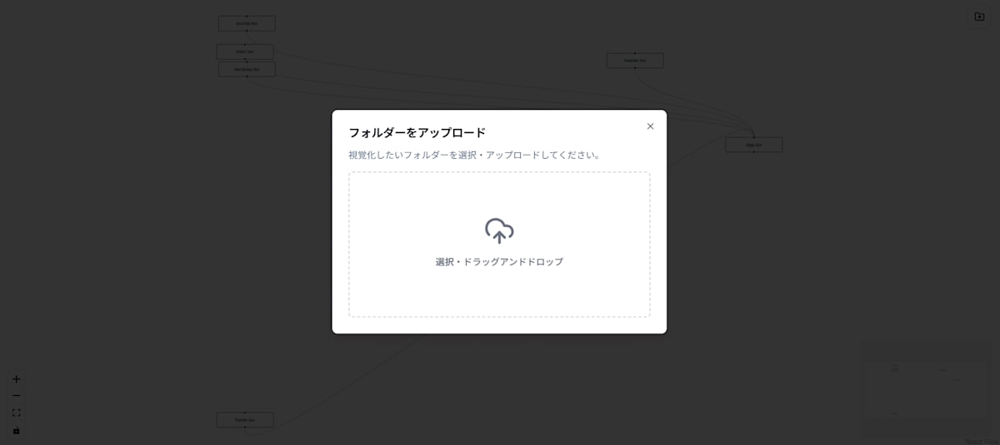

# React Dependencies Tree
コンポーネントのつながりを可視化して、リファクタリングや開発の時間短縮に貢献します。

## 開発理由
他の開発者のReactプロジェクトを見るとき、コンポーネントがどこから呼び出されているかを一個ずつ確認していくのがしんどいと思っていました。一気に可視化することで呼び出されているコンポーネントを探す時間を短縮できるのではないかと考え開発しました。

## 主な機能
### 1. フォルダのアップロード
解析したいフォルダをアップロードすることができます。そのフォルダの配下にあるファイルを探索するので、別のフォルダから呼び出されている場合はマップに表示されません。

### 2. コンポーネントのマップを表示
コンポーネントのマップには`React Flow`を使用しています。様々なプロジェクトでも採用されている実績があるので採用しました。コンポーネントのカードは動かすことができ、コンポーネントの探索に役立ちます。ファイル内の`import・export`を探索し、配列化して表示します。

**注意点**
生成までに少し時間がかかります。生成が完了すると通知が送られます。

## 技術スタック
最近の王道とも言える技術スタックで実装しました。

1. Next.js
2. Tailwind CSS
3. React Flow
4. Vercel　

## 連絡
何かありましたら、TwitterのDMにお願いいたします。